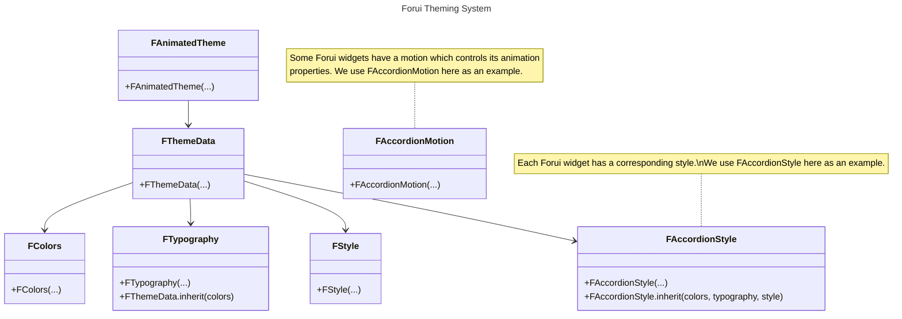

import {Callout} from "fumadocs-ui/components/callout";
import { CodeSnippet } from '@/components/code-snippet/code-snippet';
import gettingStartedSnippet from '@/snippets/snippets/themes/getting_started/getting_started.json';
import componentsSnippet from '@/snippets/snippets/themes/components/components.json';
import colorsSnippet from '@/snippets/snippets/themes/components/colors.json';
import typographySnippet from '@/snippets/snippets/themes/components/typography.json';
import styleSnippet from '@/snippets/snippets/themes/components/style.json';
import widgetStateMapSnippet from '@/snippets/snippets/themes/components/widget_state_map.json';
import mainSnippet from '@/snippets/snippets/themes/customization/main.json';
import themeSnippet from '@/snippets/snippets/themes/customization/theme/theme.json';
import accordionStyleSnippet from '@/snippets/snippets/themes/customization/theme/accordion_style.json';
import copyWithSnippet from '@/snippets/snippets/themes/customization/copy_with.json';
import copyWithCallSnippet from '@/snippets/snippets/themes/customization/copy_with_call.json';
import modifyStyleSnippet from '@/snippets/snippets/themes/customization/modify_style.json';
import passStyleSnippet from '@/snippets/snippets/themes/customization/pass_style.json';
import customFontFamilySnippet from '@/snippets/snippets/themes/customization/custom_font_family.json';
import brandColorSnippet from '@/snippets/snippets/themes/custom_properties/brand_color.json';
import extensionsSnippet from '@/snippets/snippets/themes/custom_properties/extensions.json';
import getterSnippet from '@/snippets/snippets/themes/custom_properties/getter.json';
import accessPropertiesSnippet from '@/snippets/snippets/themes/custom_properties/access_properties.json';
import copyWithExtensionsSnippet from '@/snippets/snippets/themes/custom_properties/copy_with.json';
import approximateMaterialThemeSnippet from '@/snippets/snippets/themes/material_interop/apporximate_material_theme.json';

export function Theme({title, color}) {
    return (
        <div className="flex items-center space-x-2">
            <div className="h-4 w-4 rounded-full" style={{backgroundColor: color}}/>
            <p className="font-medium">{title}</p>
        </div>
    );
}

Forui themes allow you to define a consistent visual style across your application & widgets. It relies on the [CLI](cli)
to generate themes and styles that can be directly modified in your project.

## Getting Started

<Callout type="info" title="Theme Brightness">
    Forui does not manage the theme brightness (light or dark) automatically.
    You need to specify the theme explicitly in `FAnimatedTheme(...)`.

    <CodeSnippet snippet={gettingStartedSnippet} />
</Callout>

Forui includes predefined themes that can be used out of the box. They are heavily inspired by [shadcn/ui](https://ui.shadcn.com/themes).

| Theme                                    | Light Accessor         | Dark Accessor         |
|:-----------------------------------------|:-----------------------|:----------------------|
| <Theme title="Zinc" color="#18181b" />   | `FThemes.zinc.light`   | `FThemes.zinc.dark`   |
| <Theme title="Slate" color="#64748b" />  | `FThemes.slate.light`  | `FThemes.slate.dark`  |
| <Theme title="Red" color="#dc2626" />    | `FThemes.red.light`    | `FThemes.red.dark`    |
| <Theme title="Rose" color="#e11d48" />   | `FThemes.rose.light`   | `FThemes.rose.dark`   |
| <Theme title="Orange" color="#f97316" /> | `FThemes.orange.light` | `FThemes.orange.dark` |
| <Theme title="Green" color="#16a34a" />  | `FThemes.green.light`  | `FThemes.green.dark`  |
| <Theme title="Blue" color="#2563eb" />   | `FThemes.blue.light`   | `FThemes.blue.dark`   |
| <Theme title="Yellow" color="#facc15" /> | `FThemes.yellow.light` | `FThemes.yellow.dark` |
| <Theme title="Violet" color="#7c3aed" /> | `FThemes.violet.light` | `FThemes.violet.dark` |

## Theme Components



There are **6** core components in Forui's theming system.

- **[`FAnimatedTheme`](https://pub.dev/documentation/forui/latest/forui.theme/FAnimatedTheme-class.html)**: The root widget that provides the theme data to all widgets in the subtree.
- **[`FThemeData`](https://pub.dev/documentation/forui/latest/forui.theme/FThemeData-class.html)**: Main class that holds:
  - **[`FColors`](https://pub.dev/documentation/forui/latest/forui.theme/FColors-class.html)**: Color scheme including primary, foreground, and background colors.
  - **[`FTypography`](https://pub.dev/documentation/forui/latest/forui.theme/FTypography-class.html)**: Typography settings including font family and text styles.
  - **[`FStyle`](https://pub.dev/documentation/forui/latest/forui.theme/FStyle-class.html)**: Misc. options such as border radius and icon size.
  - Individual widget styles.
  - Individual widget motions.

The included `BuildContext` extension allows `FThemeData` can be accessed via [`context.theme`](https://pub.dev/documentation/forui/latest/forui.theme/FThemeBuildContext.html):

<CodeSnippet snippet={componentsSnippet} />

### Colors

The `FColors` class contains the theme's color scheme. Colors come in **pairs** - a main color and its corresponding
foreground color for text and icons.

For example:

- `primary` (background) + `primaryForeground` (text/icons)
- `secondary` (background) + `secondaryForeground` (text/icons)
- `destructive` (background) + `destructiveForeground` (text/icons)

<CodeSnippet snippet={colorsSnippet} />

#### Hovered and Disabled Colors

To create hovered and disabled color variants, use the [`FColors.hover`](https://pub.dev/documentation/forui/latest/forui.theme/FColors/hover.html)
and [`FColors.disable`](https://pub.dev/documentation/forui/latest/forui.theme/FColors/disable.html) methods.

### Typography

The `FTypography` class contains the theme's typography settings, including the default font family and various text
styles.

<Callout type="info">
    The `TextStyle`s in `FTypography` are based on [Tailwind CSS Font Size](https://tailwindcss.com/docs/font-size).
    For example, `FTypography.sm` is the equivalent of `text-sm` in Tailwind CSS.
</Callout>

`FTypography`'s text styles only specify `fontSize` and `height`. Use `copyWith()` to add colors and other properties:

<CodeSnippet snippet={typographySnippet} />

#### Custom Font Family

Use the `copyWith()` method to change the default font family. As some fonts may have different sizes, the `scale()`
method is provided to quickly scale all the font sizes.

<CodeSnippet snippet={customFontFamilySnippet} />

### Style

The `FStyle` class the theme's miscellaneous styling options such as the default border radius and icon size.

<CodeSnippet snippet={styleSnippet} />

### `FWidgetStateMap`

[`FWidgetStateMap`](https://pub.dev/documentation/forui/latest/forui.theme/FWidgetStateMap-class.html) lets you define
different values based on [`WidgetState`](https://api.flutter.dev/flutter/widgets/WidgetState.html) combinations such as
`hovered & pressed` and `focused | disabled`.

This is useful for describing how widgets should respond to user interaction.

Each combination is also known as a **constraint**. Constraints are evaluated from top to bottom. The first matching will
be used. In general, more specific constraints should be placed above more general ones.

In the following example, given the states `{hovered, pressed}`, the 1st constraint will **always** match.

<CodeSnippet snippet={widgetStateMapSnippet} />

Most `FWidgetStateMap` fields only support a subset of states. For example, [`FButtonStyle.decoration`](https://pub.dev/documentation/forui/latest/forui.widgets.button/FButtonStyle/decoration.html)
only supports the disabled, hovered, pressed and focused states. A field's supported states are documented in its [API docs](https://pub.dev/documentation/forui/latest/forui.widgets.button/FButtonStyle/decoration.html).

## Customization

Forui provides **2** ways to customize themes and widget styles.

- [**CLI**](#themes) - major and reusable style changes, such as creating your own design system.
- [**`copyWith(...)`**](#copywith) method - minor and one-off adjustments to existing styles.

### Themes

The following section demonstrates how to use the [CLI](cli) generate a **theme** and **widget style** that you can
directly modify to fit your design needs.

We use [`FAccordionStyle`](https://pub.dev/documentation/forui/latest/forui.widgets.accordion/FAccordionStyle-class.html)
as an example, but the same principles apply to all Forui widgets.

#### Generate `main.dart`

Navigate to your project directory.

Run to generate a `main.dart`:

```shell copy
dart run forui init
```

This generates a `main.dart` file where you will add your generated theme:

<CodeSnippet snippet={mainSnippet} />

#### Generate a Theme

Run to generate a theme based on [zinc](#getting-started)'s light variant:

```shell copy
dart run forui theme create zinc-light
```

<Callout type="info">
    Tip: Run `dart run forui theme ls` to see all available themes.
</Callout>

This generates a theme file which you can:

- add to your generated `main.dart`.
- add the generated styles to.

<CodeSnippet snippet={themeSnippet} />

#### Generate a Style

Run to generate a [`FAccordionStyle`](https://pub.dev/documentation/forui/latest/forui.widgets.accordion/FAccordionStyle-class.html):

```shell copy
dart run forui style create accordion
```

<Callout type="info">
    Tip: Run `dart run forui style ls` to see all available styles.
</Callout>

This generates a accordion style file which you can add to your theme:

<CodeSnippet snippet={accordionStyleSnippet} />

See [`FWidgetStateMap`](#fwidgetstatemap) for more information on `FWidgetStateMap`s.

### Individual Widget Styles

You can customize a widget's style in **2** ways:

- Use `copyWith()` - Best for minor adjustments to existing styles.
- Generate via CLI - Best for major style overhauls.

#### `copyWith(...)`

All widgets and style `copyWith(...)`s accept style builder functions.

To change an accordion's focused outline color:

<CodeSnippet snippet={copyWithSnippet} />

All styles implement the [`call` function](https://dart.dev/language/callable-objects). This allows a style object to be
passed directly to a widget or style's `copyWith(...)` as a shortcut.

Both are equivalent:

<CodeSnippet snippet={copyWithCallSnippet} />

#### CLI

The following sections demonstrate how to override an accordion's style.

##### Generate the Style

Run to generate a widget style:

```shell copy
dart run forui style create accordion
```

<Callout type="info">
    Tip: Run `dart run forui style ls` to see all available styles.
</Callout>

##### Modify the Style

This example shows how to add underlining when the accordion title is focused, in addition to the existing hover and press states:

<CodeSnippet snippet={modifyStyleSnippet} />

See [`FWidgetStateMap`](#fwidgetstatemap) for more information on `FWidgetStateMap`s.

##### Pass the Style

<CodeSnippet snippet={passStyleSnippet} />

## Custom Properties

Forui themes can be extended with your own application-specific properties using Flutter's [`ThemeExtension`](https://api.flutter.dev/flutter/material/ThemeExtension-class.html)
system.

### Create a Theme Extension

Theme extensions must extend `ThemeExtension` and implement `copyWith()` and `lerp()`.

<CodeSnippet snippet={brandColorSnippet} />

Add the extension to `FThemeData(...)` via its `extensions` parameter:

<CodeSnippet snippet={extensionsSnippet} />

You can also add extensions to existing themes using `copyWith(...)`:

<CodeSnippet snippet={copyWithExtensionsSnippet} />

### Accessing the Properties

Retrieve your custom theme extension via [`extension<T>()`](https://pub.dev/documentation/forui/latest/forui.theme/FThemeData/extension.html):

<CodeSnippet snippet={accessPropertiesSnippet} />

Optionally, we recommend creating a getter on `FThemeData`:

<CodeSnippet snippet={getterSnippet} />

## Material Interoperability

Forui provides **2** ways to convert [`FThemeData`](https://pub.dev/documentation/forui/latest/forui.theme/FThemeData-class.html)
to Material's [`ThemeData`](https://api.flutter.dev/flutter/material/ThemeData-class.html).

This is useful when:

- Using Material widgets within a Forui application.
- Maintaining consistent theming across both Forui and Material components.
- Gradually migrating from Material to Forui.

### `toApproximateMaterialTheme()`

A Forui theme can be converted to a Material theme using
[`toApproximateMaterialTheme()`](https://pub.dev/documentation/forui/latest/forui.theme/FThemeData/toApproximateMaterialTheme.html).

<Callout type="warning">
  The `toApproximateMaterialTheme()` method is marked as experimental. This method can change without prior warning. The
  mapping between Forui and Material themes is done on a best-effort basis, and may not perfectly capture all the nuances
  of a Forui theme.
</Callout>

<CodeSnippet snippet={approximateMaterialThemeSnippet} />

### CLI

Use the CLI to generate a copy of `toApproximateMaterialTheme()` inside your project:

```shell copy
dart run forui snippet create material-mapping
```

This should be preferred when you want to fine-tune the mapping between Forui and Material themes, as it allows you to
modify the generated mapping directly to fit your design needs.
